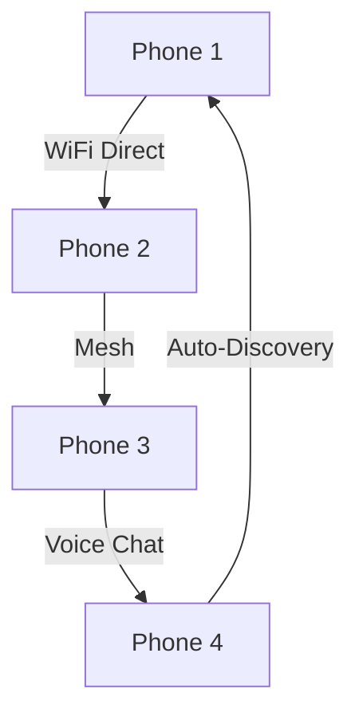
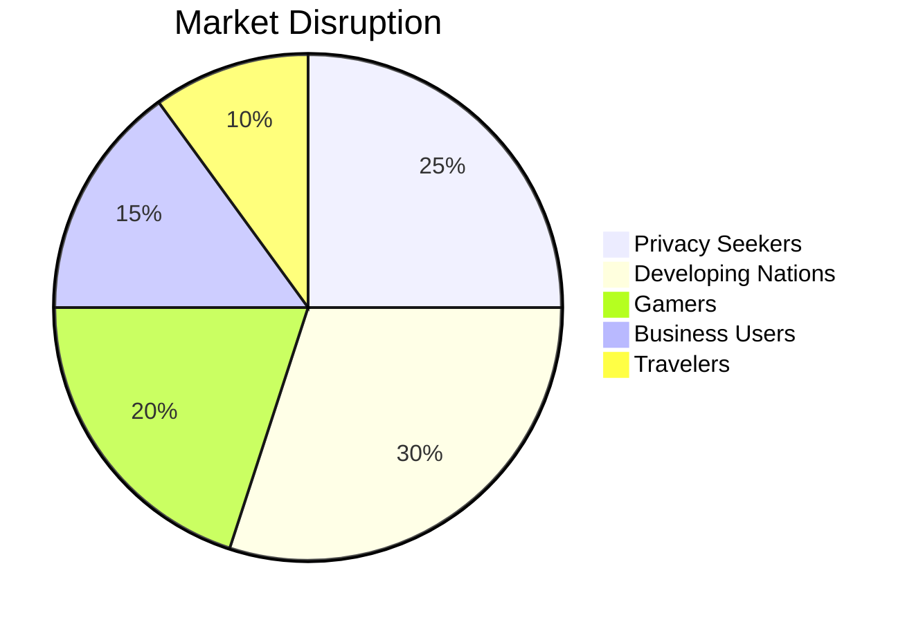

# ✨MyNetwerk✨


### **The World's First Truly Independent Smartphone**

🚀 *Your Phone. Your Data. Your Choice. No Carriers Required.* 🚀

[](https://github.com/MyNetwerk/Phone)  
[](https://twitter.com/MyNetwerk)

<p>
  
</p>

## 🌟 Revolutionary Features

### 🧠 MyNetwerk Intelligence

* ✨ 100% **On-Device AI** – Zero cloud dependency  
* 🎯 **Voice Orchestrator** – Speak and control everything  
* 🤖 **Dedicated Action Agents** per task  
* 🗣️ Operate your phone through **Natural Conversation**  

### 🔐 Ultimate Biometric Security

* 👆 **Full-Screen Fingerprint** – Touch anywhere to unlock  
* 📸 **3D Face Recognition** – Depth + spoof prevention  
* 💥 **Anti-Forensics Mode** – Full disk encryption  

---

## 📡 Zero Carrier Dependency

```
🚫 No SIM Required      |    🆓 WiFi Calling & Messaging
🌐 Global Compatibility |    📦 Works Right Out of the Box
🔐 No KYC, No Contracts |    🌎 Use Anywhere with WiFi
```

---

## 🎮 Gaming Powerhouse: Switch Meets Smartphone

| Feature           | Description             | ✅ |
| ----------------- | ----------------------- | - |
| 🎯 P2P Gaming     | No internet needed      | ✅ |
| 🔄 Landscape Mode | Console-like play       | ✅ |
| 👾 Retro Library  | Classic titles built-in | ✅ |
| 🔫 FPS Engine     | Custom multiplayer      | ✅ |

### 🌐 Mesh Gaming Network



---

## 🗺️ Offline-First Navigation

### 🧭 Intelligent Map Features

* 🤖 AI preloads maps before you need them  
* 🔌 No internet required  
* 📥 Predictive offline data updates  
* 🔒 Private GPS: No data shared  

**Data Usage Comparison:**

| Service       | Data Usage | Privacy    |
| ------------- | ---------- | ---------- |
| Google Maps   | 🔴 High    | 🔴 Poor    |
| Apple Maps    | 🟡 Medium  | 🟡 Fair    |
| MyNetwerk     | 🟢 Minimal | 🟢 Perfect |

---

## 🛡️ MyNetwerk Zero Trust Browser

| Feature             | Traditional      | MyNetwerk         |
| ------------------- | ---------------- | ----------------- |
| Banking & Finance   | 🔴 Multiple Apps | 🟢 All-in-One     |
| Privacy             | 🔴 Tracked       | 🟢 No Tracking    |
| Anti-Phishing       | 🔴 Basic         | 🟢 Hacker Defense |
| Built-in Utilities  | 🔴 Multiple Apps | 🟢 All-in-One     |
| Enterprise Security | 🔴 Weak          | 🟢 VPN & Lockdown |

---

## 🎵 Premium Media Experience

| Music Hub         | Video Platform        | Creator Suite     |
| ----------------- | --------------------- | ----------------- |
| 🎶 Lossless Audio | 🎬 Offline Playback   | 📸 Photo Editor   |
| 🎧 AI Curation    | ⬇️ My Media Server    | 🎞️ Video Tools    |
| 📱 Local Focus    | 📺 Screen Casting     | 🔄 Social Sharing |

---

## ⚙️ Tech Specs

```yaml
Processor:
  SoC: MediaTek Dimensity 6100+
  Architecture: 6nm, 8-core
  Gaming Optimized

Memory:
  RAM: 6GB (8GB Pro)
  Storage: 128GB (256GB Pro)
  Expandable: MicroSD up to 1TB

Display:
  6.5" FHD+ (2400x1080)
  IPS, 120Hz, Gorilla Glass 5
  Full-Screen Fingerprint

Battery:
  5000mAh, 33W fast charge
  Qi Wireless, USB-C PD

Connectivity:
  WiFi 6, Bluetooth 5.3
  GPS, Single SIM
  3.5mm jack, stereo speakers
```

---

## 💰 Pricing Strategy

| Model            | Price     | Big Brands  | Savings    |
| ---------------- | --------- | ----------- | ---------- |
| MyNetwerk Basic  | **$349**  | $799+       | **$450+**  |
| MyNetwerk Tier 1 | **$549**  | $1099+      | **$650+**  |

---

## 🌍 Global Advantage

### 🌎 Tailored for Developing Markets

* 📱 **65% cheaper** than flagships  
* 📶 **90% less data use**  
* 💰 **$0 monthly plans**  
* 🛠️ **Repairable design**  

**Market Fit:**

* WiFi-first nations  
* Game-driven youth  
* Financial inclusion  
* Rugged terrain use  

---

## 🔒 Privacy & Security

| Feature          | Big Tech Phones | MyNetwerk  |
| ---------------- | --------------- | ---------- |
| Cloud Dependence | 🔴 Required     | 🟢 None    |
| Tracking         | 🔴 Constant     | 🟢 Blocked |
| AI Processing    | 🔴 Cloud        | 🟢 Local   |
| Data Ownership   | 🔴 Corporations | 🟢 User    |
| Update Control   | 🔴 Forced       | 🟢 User    |


---

## 🏆 Competitive Edge

```diff
+ ✅ Works without carriers (no plans)
+ ✅ Local-only AI (no spying)
+ ✅ Fully private browser
+ ✅ Offline-first apps
+ ✅ Gaming without internet
+ ✅ Worldwide WiFi support
+ ✅ Lower price than iPhone or Android
```

---

## 🚀 Launch Strategy



---

## 📞 Contact & Pre-Launch Info

**📧 Email:** [g7485987384@yahoo.com](mailto:g7485987384@yahoo.com)  
**🌐 Website:** [Pine64EU Store](https://pine64.org/devices/pinephone/)  
**📅 Launch Date:** 2026

[](mailto:g7485987384@yahoo.com)  
[](mailto:g7485987384@yahoo.com)

---

### 💫 **"Your Phone. Your Data. Your Choice."**
