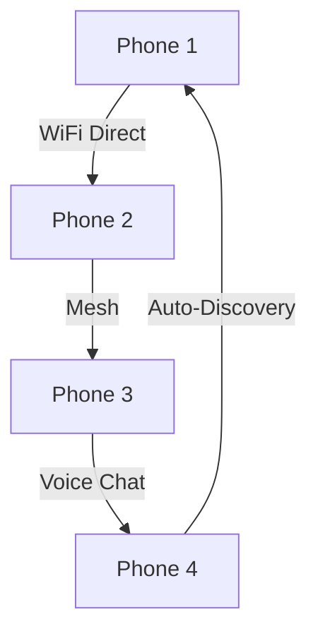
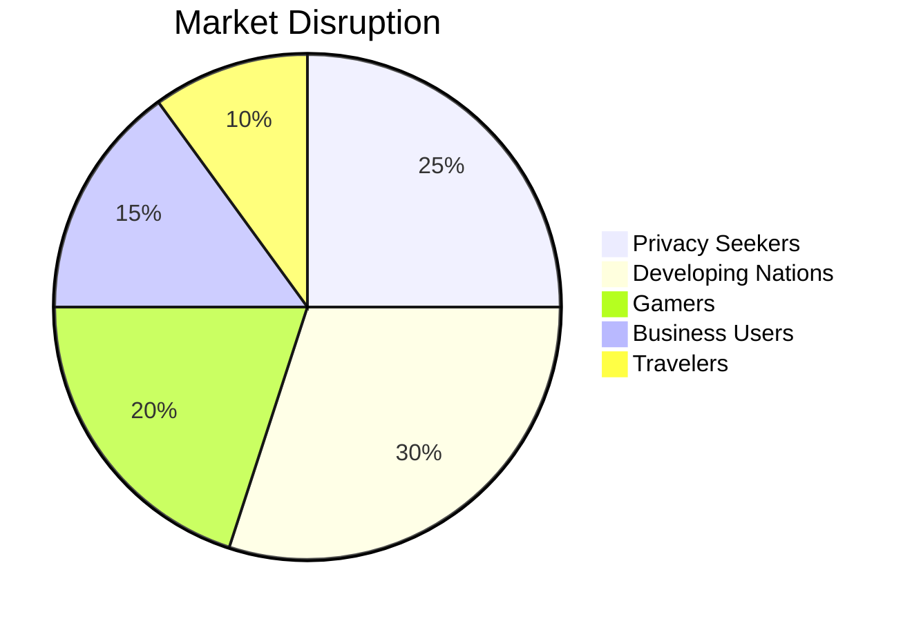

# ✨MyPhone✨


### **The World's First Truly Independent Smartphone**

<p>
  
</p>

## 🌟 Revolutionary Features

### 🧠 MyNetwerk Intelligence

* ✨ 100% **On-Device AI** – Zero cloud dependency  
* 🎯 **Voice Orchestrator** – Speak and control everything  
* 🤖 **Dedicated Action Agents** per task  

### 🔐 Ultimate Biometric Security

* 👆 **Full Screen Fingerprint** – Touch anywhere to unlock  
* 📸 **3D Face Recognition** – Depth + Spoof prevention  

---

## 📡 No Carrier Dependency

```
🚫 No SIM Required      |    🆓 Wi-Fi Calling & Messaging
🌐 Global Compatibility |    📦 Works Right Out of the Box
```

---

## 🎮 Gaming Powerhouse: Switch Meets Smartphone

| Feature           | Description          | ✅ |
| ----------------- | -------------------- | - |
| 🎯 P2P Gaming     | Wi-Fi Direct         | ✅ |
| 🔄 Landscape Mode | Console like play    | ✅ |
| 👾 Retro Library  | Classics built-in    | ✅ |

### 🌐 Mesh Gaming Network



---

## 🗺️ Offline-First Navigation

### 🧭 Intelligent Map Features

* 🤖 AI preloads maps before you need them  
* 🔌 No internet required  
* 📥 Offline data updates  

---

## 🛡️ Secure Browser

| Feature             | Traditional      | MyNetwerk                  |
| ------------------- | ---------------- | -------------------------- |
| Banking & Finance   | 🔴 Multiple Apps | 🟢 All-in-One              |
| Privacy             | 🔴 Tracked       | 🟢 No Tracking             |
| Built-in Utilities  | 🔴 Multiple Apps | 🟢 Agent Workflow          |
| Enterprise Security | 🔴 Weak          | 🟢 Virtual Private Network |

---

## 🎵 Premium Media Experience

| Music Hub         | Video Platform        | Creator Suite     |
| ----------------- | --------------------- | ----------------- |
| 🎶 Lossless Audio | 🎬 Offline Playback   | 📸 Photo Editor   |
| 🎧 AI Curation    | ⬇️ Media Server       | 🎞️ Video Tools    |
| 📱 Local Focus    | 📺 Screen Casting     | 🔄 Social Sharing |

---

## ⚙️ Tech Specs

```yaml
Processor:
  SoC: MediaTek Dimensity 6100+
  Architecture: 6nm, 8-core

Memory:
  RAM: 8GB (12GB Pro)
  Storage: 256GB (512GB Pro)
  Expandable: Up to 2TB MicroSD

Display:
  6.5" FHD+ (2400x1080)
  IPS, 120Hz, Gorilla Glass 5
  Full-Screen Fingerprint

Camera:
  Front: 16 MP Sony IMX
  Rear: 50 MP Sony IMX

Battery:
  4500mAh, 27W fast charge
  Qi Wireless, USB-C PD

Connectivity:
  WiFi 6, BT 5.3, GPS, Single SIM
  3.5mm jack, stereo speakers

Accesories:
  Protective case, Magsafe wallet,
  Headphones
```

---

## 💰 Pricing Strategy

| Model            | Price     | Big Brands  | Savings    |
| ---------------- | --------- | ----------- | ---------- |
| MyNetwerk Basic  | **$349**  | $799+       | **$450+**  |
| MyNetwerk Pro    | **$549**  | $1099+      | **$650+**  |

---

## 🌍 Global Advantage

### 🌎 Tailored for Developing Markets

* 📱 **65% cheaper** than flagships  
* 📶 **90% less data use**  
* 🛠️ **Repairable design**  

---

## 🔒 Privacy & Security

| Feature          | Other Phones    | MyNetwerk  |
| ---------------- | --------------- | ---------- |
| Cloud Dependence | 🔴 Required     | 🟢 None    |
| Tracking         | 🔴 Constant     | 🟢 Blocked |
| AI Processing    | 🔴 Cloud        | 🟢 Local   |
| Data Ownership   | 🔴 Corporations | 🟢 User    |
| Update Control   | 🔴 Forced       | 🟢 User    |


---

## 🚀 Launch Strategy


